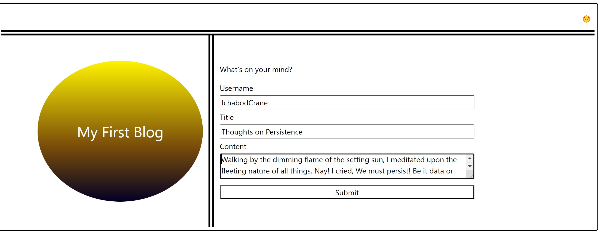

# Full-Stack Blog

## Description
This project is the first release of a simple blogging site. 

## Highlights

*Light/Dark mode is preserved when switching pages*
GIVEN User is viewing a page in Dark mode
- When User moves to the other page (either by submitting a blog post or with the [Back] button
- THEN the dark/light mode setting is persisted to local storage, and the target page opens in the same mode as the source page

JavaScript implements common elements in a class-like structure
logic.js uses the class-like structure COMMON to codify access, to common elements, from other JavaScript files
- enumerated strings such as DISPLAY_MODE_LIGHT/DISPLAY_MODE_DARK
- functions such as handleSunButtonClick()
- and fetchDisplayMode(), which handles the preservation of light/dark mode on behalf of the other pages

Bootstrap

Given the timing of class material presentaion and challenges, I'm not sure if we were meant to use Bootstrap in this challenge, but it sure came in handy.

## In This Release
This release implements the following success criteria:

GIVEN a personal blog
WHEN I load the app,
THEN I am presented with the landing page containing a form with labels and inputs for username, blog title, and blog content.
WHEN I submit the form,
THEN blog post data is stored to localStorage.
WHEN the form submits,
THEN I am redirected to the posts page.
WHEN I enter try to submit a form without a username, title, or content,
THEN I am presented with a message that prompts me to complete the form.
WHEN I view the posts page,
THEN I am presented with a header, with a light mode/dark mode toggle, and a "Back" button.
WHEN I click the light mode/dark mode toggle,
THEN the page content's styles update to reflect the selection.
WHEN I click the "Back" button,
THEN I am redirected back to the landing page where I can input more blog entries.
WHEN I view the main content,
THEN I am presented with a list of blog posts that are pulled from localStorage.
WHEN I view localStorage,
THEN I am presented with a JSON array of blog post objects, each including the post author's username, title of the post, and post's content.
WHEN I take a closer look at a single blog entry in the list,
THEN I can see the title, the content, and the author of the post.
WHEN I view the footer,
THEN I am presented with a link to the developer's portfolio.

## Installation
N/A

## Usage
Open [the deployed application](https://crestonesoftware.github.io/04-challenge-blog/index.html/)

### Landing Page: Add Blog Post
1) Fill in Username, Title and Content
2) Click [Submit] 

Result: the blog post is persisted to local storage and the browser redirects to the Blog page, which displays all posts

### Either Page: Toggle Light/Dark Mode
Click the Happy Sun icon, in the upper-right-hand corner of either page, to toggle between light and dark mode

### Blog Page: Back
From the Blog page, click [Back] to return to the landing page

## Credits
Thank you to the good folks at Bootstrap https://getbootstrap.com/ for providing template code for the layout of the 
